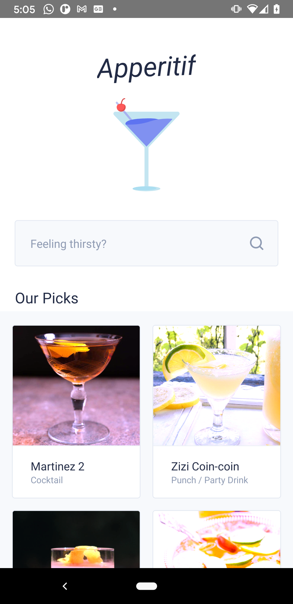
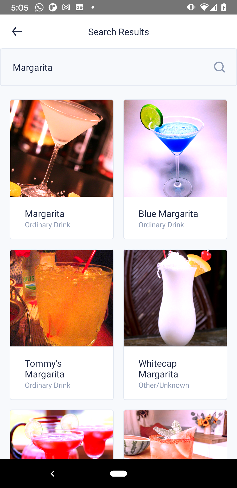
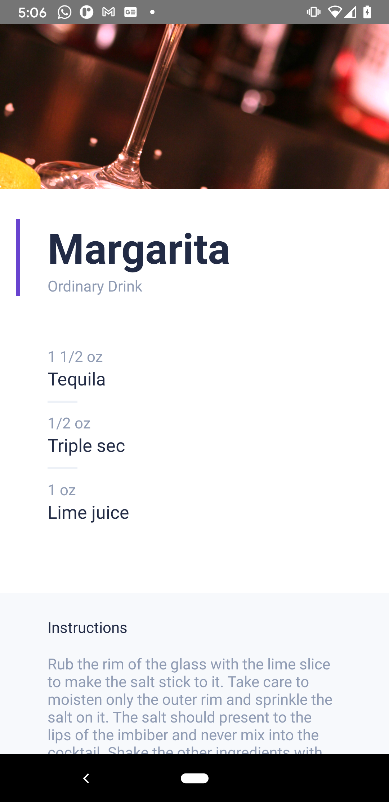

# Apperitif

Cocktails recipe app created to learn react native. I wanted to quickly learn how hard it was to move from FE (React) to app development with something like rn and to see what are the main gotchas! Planning to write a full post about my learning in my [blog](http://juanmanuelalloron.com/)

## Features

Pick from our top choices or search for cocktail names! Offline support for our picks and previous searches. 

<table>
  <tr>
    <td>Home Screen</td>
     <td>Search Screen</td>
     <td>Details Screen</td>
  </tr>
  <tr>
    <td style="border: 0; padding: 2; margin: 0" ></td>
    <td style="border: 0; padding: 2; margin: 0"></td>
    <td style="border: 0; padding: 2; margin: 0"></td>
  </tr>
 </table>

### Coming soon

Planning to add a couple more features before calling this POC project done:
- I am feeling lucky screen (random cocktail selection)
- Share cocktails (Both deep links and share intents)
- Testing (Still exploring wich test fwk to use)
- Google analytics integration
- Figure out the metadata to upload to an store

## Architecture

- Using [React Native UI Kitten](https://akveo.github.io/react-native-ui-kitten/) for look and feel and components.
- Theme created from [Colors Eva Design System](https://colors.eva.design/) and leveraging [eva icons](https://akveo.github.io/eva-icons)
- [React Router](https://github.com/ReactTraining/react-router) to handle navigation and transitions (and probably deep links).
- [react Native offline](https://github.com/rgommezz/react-native-offline) to check for network connectivity
- Simple Fetch + AppStorage cache for pulling data from a [public API](https://www.thecocktaildb.com/). 
- [React Native SVG](react-native-svg) to inline the logo
- [React Native Color Matrix Image Filters](https://github.com/iyegoroff/react-native-color-matrix-image-filters) to add some effects to the API images.
  
## Setup

**Prerequisites**: Make sure that you have android SDK and xcode to run simulators

- `yarn install`
- `yarn android` | `yarn ios` to run in simulator/device

